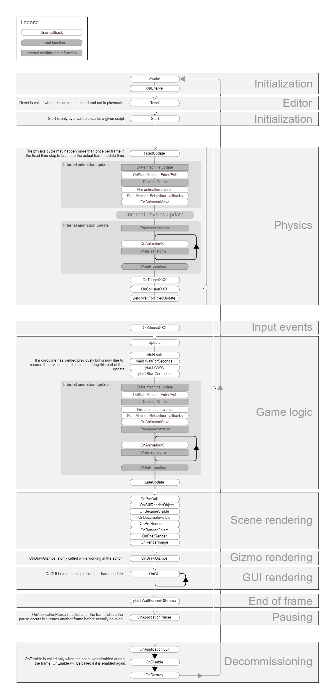

# Execution Order

## Table of Contents

- [Introduction](#Introduction)
    - [Script lifecycle flowchart](#Script-lifecycle-flowchart)
- [First Scene Load](#First-Scene-Load)
- [Editor](#Editor)
- [Before The First Frame Update](#Before-The-First-Frame-Update)
- [In between frames](#in-between-frames)
- [Update order]
- [Animation update loop]
- [Rendering]
- [Coroutines]
- [When The Object Is Destroyed](#when-the-object-is-destroyed)
- [When quitting](#when-quitting)
---
## Introduction
**When a Unity script runs, number of events & functions executes in order. In this repository we will learn about those execution orders.**
- ### Script lifecycle flowchart
- 
---
## First Scene Load

**These functions get called when a scene starts**

- **Awake:** Before any start functions and just after prefab is instantiated, it is called.
    - If a GameObject is inactive during start up, Awake is not called until it is made active.
- **OnEnable:** Only called just after the object is enabled.
---
## Editor

**These functions get called after script set**

- **Reset:** When script is attached to game object, Reset function is called to initialize the script’s properties.
- **OnValidate:** It is called when the script is loaded or a value changes in the Inspector. Use OnValidate function to perform an action after a value changes in the Inspector; for example, making sure that data stays within a certain range.
    - [Example](https://www.youtube.com/watch?v=G4jVTBA49Rc)
---
## Before The First Frame Update

**For objects that are part of a scene asset, this function is called before Update**

- **Start:** Start is called before the first frame update whenever the script instance is enabled.
---
## In Between Frames

- **OnApplicationPause:** At the end of the frame is called where the pause is detected.
---
## Update Order

---
## Animation Update Loop

---
## Useful Profile Markers

---
## Rendering

---
## Coroutines

---
## When The Object Is Destroyed

- **OnDestroy:** This function is called on the last frame of object before destroying.
---
## When Quitting

- **OnApplicationQuit:** Before the application is quit called. In the editor it is called when the user stops playmode.
- **OnDisable:** When object becomes disabled or inactive is called.
---